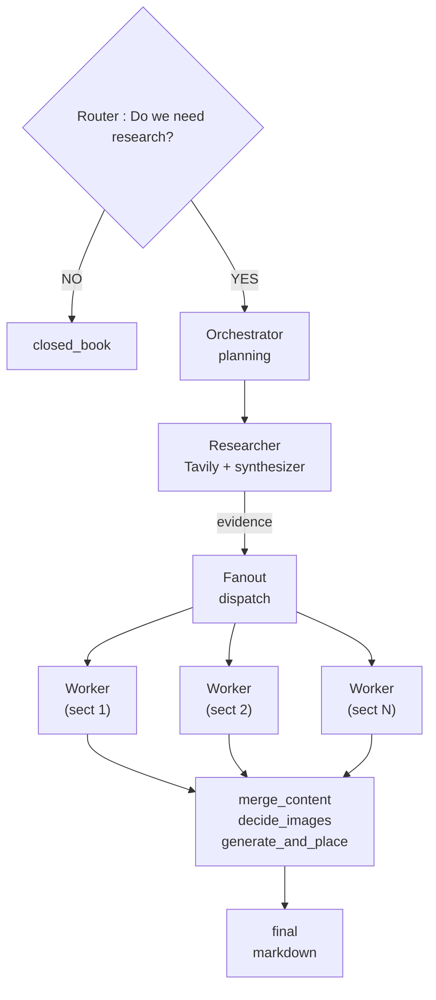

```mermaid
graph TD
    Router{"Router : Do we need research?"}
    Router -->|NO| ClosedBook[closed_book]
    Router -->|YES| Orchestrator[Orchestrator <br> planning]
    
    Orchestrator --> Researcher[Researcher <br> Tavily + synthesizer]
    Researcher -->|evidence| Fanout[Fanout <br> dispatch]
    
    Fanout --> Worker1["Worker <br> (sect 1)"]
    Fanout --> Worker2["Worker <br> (sect 2)"]
    Fanout --> WorkerN["Worker <br> (sect N)"]
    
    Worker1 --> Merge[merge_content <br> decide_images <br> generate_and_place]
    Worker2 --> Merge
    WorkerN --> Merge
    
    Merge --> Final[final <br> markdown]
```
